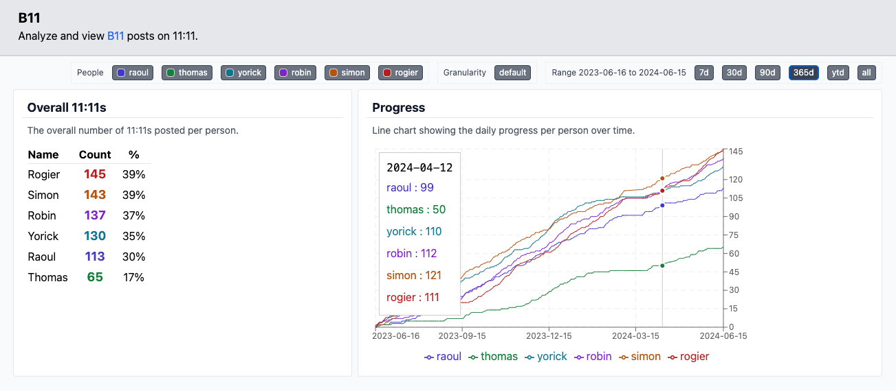

# B11
Analyze and view [B11](https://svsticky.nl/nl/besturen/11) posts on 11:11.


[](https://app.netlify.com/sites/b11-11/deploys)

## Getting started
To view B11 posts at 11:11, provide the message exports, extract the daily records, and open the dashboard. `extract/` and `visualize/` are separate applications; they share `output/latest.txt`. Run `npm install` at the repository root to install both applications. The root `package.json` also provides shortcuts to run and test them.

> You can skip the first two steps if you want to use the latest data included in this repository.

### 1. Add data
Create a `data/` directory in the root of this repository and add the CSV file and txt file exports from WhatsApp to this directory.

- Expected .csv header: `sender_jid_row_id;timestamp;received_timestamp;receipt_server_timestamp;text_data`
- Expected .nl.txt format: `18-09-2020 09:55 - Simon Karman: Hoe gaat het?`

### 2. Extract
Run the extractor from the repository root after installing dependencies:
```bash
npm run extract
```

This creates `output/latest.txt`, the single source of truth for the dashboard. Each line contains a date and the people who posted. A `~` before a name means the post was close to 11:11, but not exact. Those entries remain available for manual inspection, but the dashboard ignores them. The script also writes a timestamped text snapshot in `output/`.

### 3. Visualize
The `visualize/` directory contains a React app that reads `latest.txt`, calculates statistics for the selected date range and people, and visualizes the results using [recharts](https://recharts.org). The app can be found at [b11-11.netlify.app](https://b11-11.netlify.app/).

To run the visualization locally from the repository root:
```bash
npm run visualize
```

Run both test suites with `npm test`.

You can now view the visualization on [localhost:3000](http://localhost:3000).

More information can be found in the [README.md](visualize/README.md) in the `visualize/` directory.

When you want to update the dashboard, add a new WhatsApp export to the local `data/` directory, run `npm run extract`, review the changes to `output/latest.txt`, and commit and push that file. The `data/` directory is ignored by Git and should be kept locally.
